# Tổng quan Kiến trúc

Hiểu kiến trúc của LegoCity giúp bạn đưa ra quyết định sáng suốt về customization và deployment.

## Kiến trúc Hệ thống

```mermaid
graph TB
    %% Nguồn Dữ Liệu
    subgraph L1["🌐 NGUỒN DỮ LIỆU"]
        DS1["Máy chủ nguồn A<br/>Cảm biến IoT"]
        DS2["Máy chủ nguồn B<br/>Camera AI API"]
        DS3["Máy chủ nguồn N"]
    end
    
    %% Context Broker
    subgraph L2["🔄 CONTEXT BROKER"]
        SG["Cổng bảo mật<br/>Nginx + Xác thực"]
        
        subgraph BC["Broker Core"]
            CB["Orion-LD<br/>Context Broker"]
            MDB1[("MongoDB<br/>Trạng thái")]
        end
        
        OBN["Các node khác"]
        
        CB -->|Lưu trữ| MDB1
        CB -.->|Đồng bộ| OBN
    end
    
    %% Dashboard
    subgraph L3["📊 DASHBOARD"]
        AS["Máy chủ ứng dụng<br/>Next.js + Payload"]
        
        subgraph AC["Ứng dụng"]
            NX["Next.js"]
            PL["PayloadCMS"]
            NX <-->|API| PL
        end
        
        MDB2[("Cơ sở dữ liệu<br/>MongoDB")]
        
        AS --> AC
        PL -->|CRUD| MDB2
    end
    
    %% Mối quan hệ
    subgraph NR["ℹ️ Quan hệ N-N"]
        INFO["1 Dashboard → N Brokers<br/>1 Broker → N Dashboards"]
    end
    
    %% Dòng dữ liệu
    DS1 ==>|POST<br/>NGSI-LD| SG
    DS2 ==>|POST<br/>NGSI-LD| SG
    DS3 ==>|POST<br/>NGSI-LD| SG
    
    SG ==>|Định tuyến| CB
    AS <==>|GET/SUB<br/>Truy vấn| SG
    
    L2 -.- NR
    L3 -.- NR
    
    %% Styling
    classDef layer1 fill:#0891b2,stroke:#22d3ee,stroke-width:3px,color:#fff
    classDef layer2main fill:#059669,stroke:#22c55e,stroke-width:4px,color:#fff
    classDef layer2sub fill:#3b82f6,stroke:#60a5fa,stroke-width:3px,color:#fff
    classDef layer3 fill:#7c3aed,stroke:#a855f7,stroke-width:3px,color:#fff
    classDef db fill:#f97316,stroke:#fb923c,stroke-width:3px,color:#fff
    classDef info fill:#334155,stroke:#64748b,stroke-width:2px,color:#cbd5e1
    
    class DS1,DS2,DS3 layer1
    class SG layer2main
    class CB,OBN layer2sub
    class AS,NX,PL layer3
    class MDB1,MDB2 db
    class INFO info
    
    style L1 fill:#0f172a,stroke:#22d3ee,stroke-width:4px,color:#fff
    style L2 fill:#0f172a,stroke:#22c55e,stroke-width:4px,color:#fff
    style L3 fill:#0f172a,stroke:#a855f7,stroke-width:4px,color:#fff
    style BC fill:#1e293b,stroke:#64748b,stroke-width:2px,color:#94a3b8
    style AC fill:#1e293b,stroke:#64748b,stroke-width:2px,color:#94a3b8
    style NR fill:#1e293b,stroke:#94a3b8,stroke-width:2px,stroke-dasharray:5 5,color:#e2e8f0
```



::: tip Kiến trúc 3 lớp
**Nguồn dữ liệu:** Các nguồn dữ liệu IoT, sensors, cameras, external APIs đẩy dữ liệu theo chuẩn NGSI-LD

**Context Broker:** Cụm Context Broker với Security Gateway, Orion-LD và MongoDB để lưu trữ state

**Dashboard:** Máy chủ ứng dụng với Next.js và PayloadCMS để quản lý và hiển thị dữ liệu
:::

## Thiết kế Ba Lớp

### 1. Context & Data Layer

**Mục đích**: Nguồn sự thật duy nhất cho thông tin thành phố

**Components**:

- **NGSI-LD Context Broker** (Orion-LD)
- **Smart Data Models** - Schemas chuẩn hóa
- **Real-time Updates** - Subscriptions và notifications

**Key Concepts**:

```json
{
  "id": "urn:ngsi-ld:Sensor:001",
  "type": "AirQualitySensor",
  "location": {
    "type": "Point",
    "coordinates": [105.7851, 10.0303]
  },
  "pm25": {
    "type": "Property",
    "value": 35.2,
    "observedAt": "2024-01-15T10:30:00Z"
  }
}
```

**Responsibilities**:

- Store city entities (sensors, zones, services)
- Manage relationships giữa các entities
- Handle temporal queries
- Provide standardized API (NGSI-LD)

### 2. UI & Content Layer

**Mục đích**: Configure và render dashboard interfaces

**Components**:

- **Next.js 15** - React framework với App Router
- **PayloadCMS 3.x** - Headless CMS
- **MongoDB** - Content database
- **Mapbox GL JS** - Interactive maps

**Key Features**:

**a) Block-Based UI**

```typescript
// Pages composed from blocks
interface Page {
  title: string;
  blocks: Array<ArchiveBlock | MediaBlock | CallToActionBlock | ContentBlock>;
}
```

**b) Dynamic Configuration**

- Pages, map views, layers stored trong PayloadCMS
- No hard-coded dashboards
- Runtime configuration changes

**c) Responsive Design**

- Mobile-first approach
- Tailwind CSS styling
- Accessible components

### 3. Integration Layer

**Mục đích**: Connect external services và enhance functionality

**Components**:

- **API Proxies** - Secure external API access
- **Authentication** - JWT-based auth
- **AI Assistants** - Optional content helpers
- **Search** - Full-text search integration

**Security Patterns**:

```typescript
// API keys stored server-side
// Frontend proxies requests
fetch("/api/proxy/geocode", {
  body: JSON.stringify({ address }),
  headers: { "Content-Type": "application/json" },
});
```

## Data Flow

### Reading City Data


### Updating Content


## Technology Stack

### Frontend

- **Next.js 15** - React framework với App Router và Server Components
- **TypeScript** - Type safety
- **Tailwind CSS** - Utility-first styling
- **Mapbox GL JS** - WebGL-powered maps

### Backend

- **PayloadCMS 3.x** - Headless CMS với admin UI
- **MongoDB 6.x** - Document database
- **Node.js 18+** - JavaScript runtime

### Infrastructure

- **FIWARE Orion-LD** - NGSI-LD context broker
- **MongoDB** - Context và content storage
- **Reverse Proxy** - Nginx hoặc similar

### Optional Services

- **OpenRouter** - AI model gateway
- **Mapbox** - Map tiles và geocoding
- **Redis** - Caching layer

## Scalability Considerations

### Horizontal Scaling

**Next.js Application**:

- Stateless application servers
- Load balancer distribution
- Edge caching (CDN)

**MongoDB**:

- Replica sets cho high availability
- Sharding cho large datasets

**NGSI-LD Broker**:

- Multiple broker instances
- Federation cho multi-region

### Vertical Scaling

**Memory**:

- Next.js: 2-4 GB per instance
- MongoDB: Based on dataset size
- Broker: Based on entity count

**CPU**:

- Map rendering is CPU-intensive
- Consider GPU acceleration cho complex visualizations

### Caching Strategy

```typescript
// Next.js caching
export const revalidate = 60; // ISR every 60s

// API response caching
cache.set('entities:sensors', data, { ttl: 300 });

// CDN caching
Cache-Control: public, s-maxage=3600
```

## Security Architecture

### Authentication & Authorization


### API Security

**Server-Side Proxies**:

```typescript
// /app/api/proxy/route.ts
export async function POST(req: Request) {
  // Validate request
  const { apiKey } = getServerConfig();

  // Forward to external API
  return fetch(externalAPI, {
    headers: { Authorization: `Bearer ${apiKey}` },
  });
}
```

**Rate Limiting**:

- Per-IP limits
- Per-user quotas
- Token bucket algorithm

### Data Protection

- **Encryption at Rest**: MongoDB encryption
- **Encryption in Transit**: HTTPS/TLS
- **Secrets Management**: Environment variables, not in code
- **Input Validation**: Zod schemas, payload validators

## Deployment Architecture

### Development

```
Developer Machine
├── Next.js (localhost:3000)
├── MongoDB (localhost:27017)
└── Orion-LD (localhost:1026)
```

### Production (Single Server)

```
Virtual Machine
├── Nginx (Reverse Proxy)
├── Next.js (PM2)
├── MongoDB (Service)
└── Orion-LD (Docker)
```

### Production (Distributed)

```
Cloud Infrastructure
├── CDN (Cloudflare)
├── Load Balancer
├── Next.js Cluster (3+ instances)
├── MongoDB Replica Set
└── NGSI-LD Federation
```

## Extension Points

### 1. Custom Blocks

Add new UI components:

```typescript
// src/blocks/CustomBlock/config.ts
export const CustomBlock: Block = {
  slug: "custom-block",
  fields: [
    /* ... */
  ],
  // Block configuration
};
```

### 2. PayloadCMS Plugins

Extend CMS functionality:

```typescript
// src/plugins/customPlugin.ts
export const customPlugin = (): Plugin => ({
  name: "custom-plugin",
  // Plugin logic
});
```

### 3. API Routes

Add custom endpoints:

```typescript
// app/api/custom/route.ts
export async function GET(req: Request) {
  // Custom logic
}
```

### 4. Data Adapters

Connect new data sources:

```typescript
// lib/adapters/CustomAdapter.ts
export class CustomAdapter implements DataAdapter {
  async fetchEntities() {
    // Fetch from external source
  }
}
```

## Best Practices

### Configuration Management

✅ Store config trong PayloadCMS, not code  
✅ Use environment variables cho secrets  
✅ Version control schema definitions

### Performance

✅ Enable Next.js caching (ISR, SWR)  
✅ Optimize images (next/image)  
✅ Lazy load map layers  
✅ Use database indexes

### Security

✅ Never expose API keys tới frontend  
✅ Validate all user inputs  
✅ Implement rate limiting  
✅ Use HTTPS trong production

### Monitoring

✅ Log errors tới external service  
✅ Track performance metrics  
✅ Monitor broker health  
✅ Set up alerts

---

**Next**: [Installation Guide](../installation/local.md) để thiết lập development environment của bạn.
